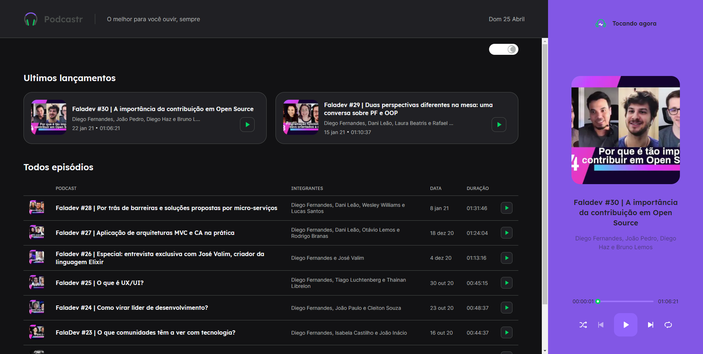
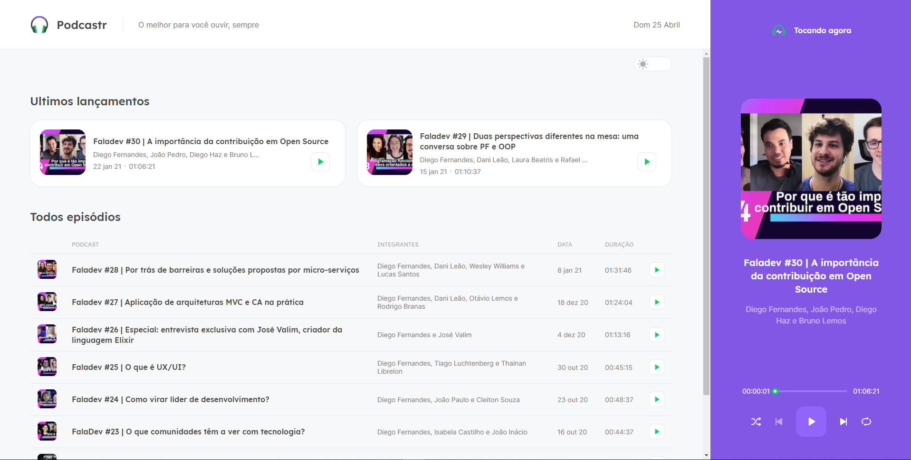
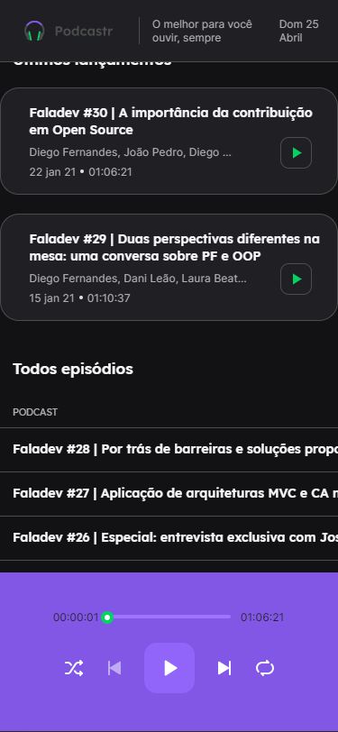
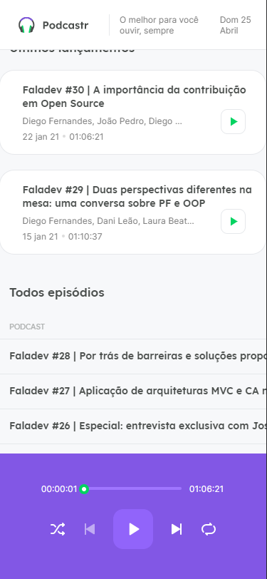

# Podcastr

#PTBR
 
App web desenvolvido durante a NLW 5 organizado pela RocketSeat.
 
Podcastr é um sistema web desenvolvido para listar podcasts e ouvi-los diretamente no site.
 
Desenvolvido usando React + Next + Typescript + JSON Server para exibir os dados em desenvolvimento.
 

#EN
 
Web app developed during NLW 5 organized by RocketSeat.
 
Podcastr is a web system developed to list podcasts and listen to them directly on the website.
 
Developed using React + Next + Typescript + JSON Server to display the data under development.
 

## Comandos

yarn ou npm install
 
yarn server ou npm run server 
 
Em outra aba execute
 
yarn dev ou npm run dev 

## Dark Theme

## Responsivo

| Home                                          | Home Tocando                                          | Detalhes do podcast                            |
| --------------------------------------------- | ----------------------------------------------------- | ---------------------------------------------- |
|             |                     |              |